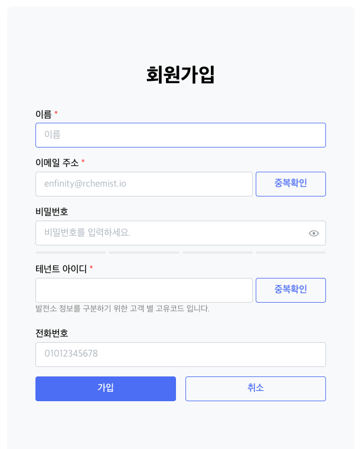
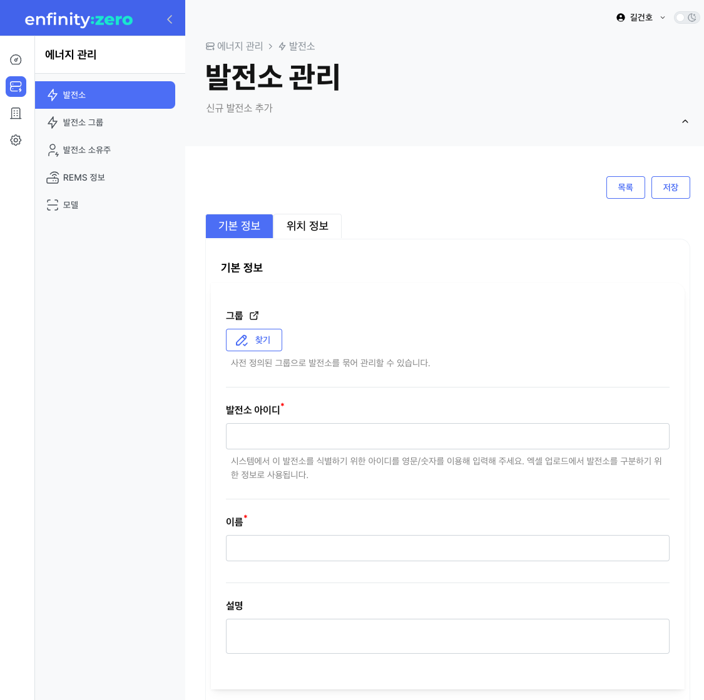
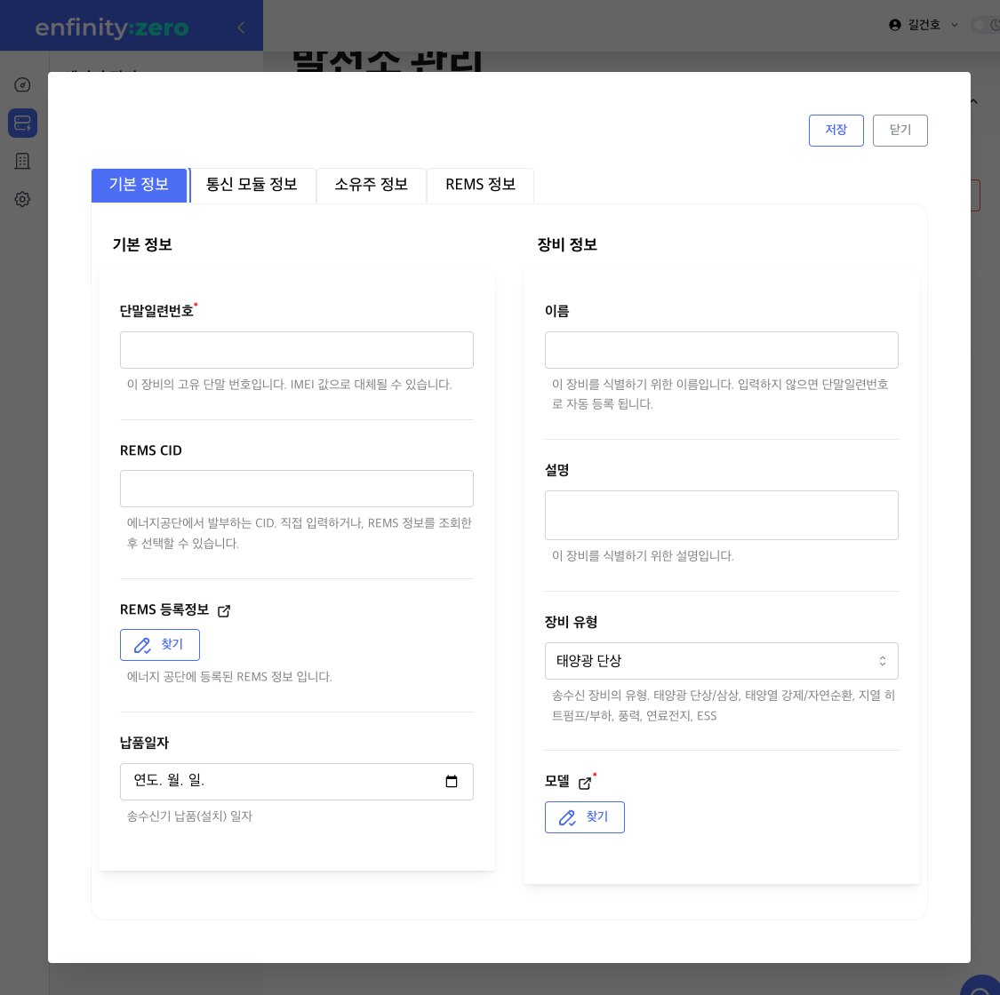
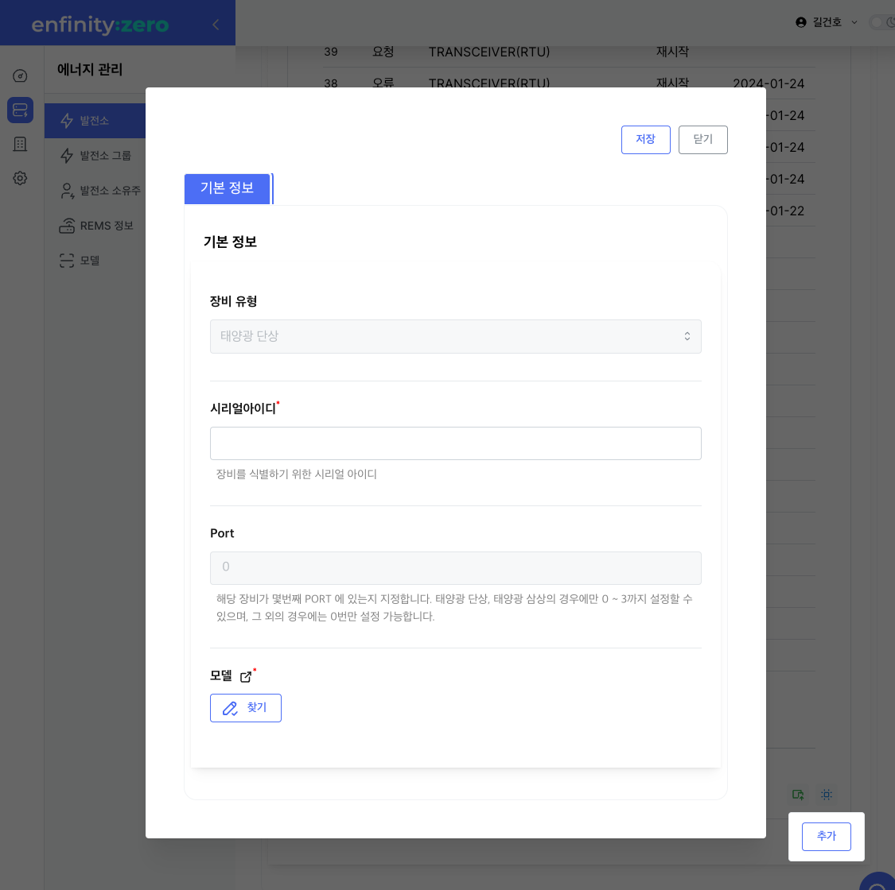
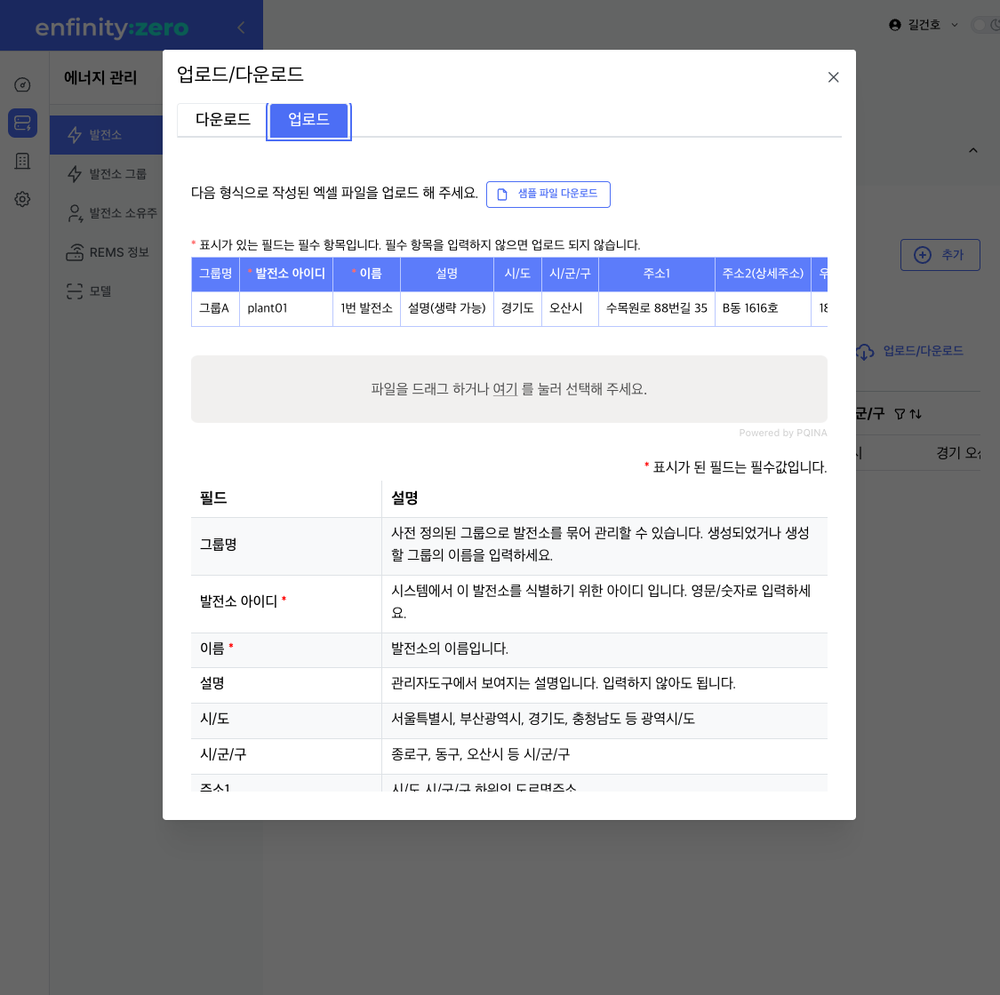

= enfinity-rems 연동 가이드 v0.1
:toc: left
:toc-title: enfinity-rems 연동 가이드
:toclevels: 2
:stylesheet: asciidoctor.css
:hardbreaks:
:doctype: book
:icons: font
:idseparator: -
:sectanchors:
:sectids:
:sectnums:
:sectlinks:
:sectnumlevels: 6
:author: kunner@rchemist.io
:authorname: Kunner, Kil.
:version-label: v0.1

[#intro]
== 소개

enfinity-REMS 서비스에 RTU 등 송수신기 장비를 연동하는 방법에 대해 설명합니다.

- 문서 버전: v0.1
- 최종 수정일: 2024-01-31

[#devices]
== 장비 Devices

*- Transceiver 송수신기*

* RTU 나 Gateway 등 인터넷에 연결해 데이터를 송수신하는 IoT 장치를 의미합니다.
* 하나의 Transceiver 에는 하나 이상의 Module 이 연결될 수 있습니다.
* Transceiver 는 _HTTPS_ 또는 _MQTT_ 프로토콜을 이용해 데이터를 송수신할 수 있어야 합니다.

*- Module*

* 검침 정보(Meter)를 수집하거나, 기타 서비스에 필요한 정보를 수집해 연결된 Transceiver 로 전송하는 장치 입니다.
* 미터기나 인버터 같은 장치가 Module 이 될 수 있습니다.
* 하나의 Transciever 에 여러 Module 이 연결될 수 있으며, 이때 각 Module 은 0부터 순차 증가하는 PORT 번호로 구분됩니다.{blank}
_단, 에너지공단 REMS 의 경우에는 태양광 RTU에 한해 0 ~ 3 까지 총 4개의 모듈만 인식 가능_

[#importants]
== 서버 연동을 위한 주요 정보

[#importants-server]
=== 서버 정보

*운영서버*

.운영 서버
[cols="<.^2,<.^2,<.^6"]
|===
|구분 |URL |설명

|웹서비스 |https://enfinity.kr |관리도구 서비스 사이트
|API |https://api.enfinity.kr |장비 -&gt; 서버 HTTP API 서버 {blank}
|METER-API |https://meter.enfinity.kr |장비 -&gt; 서버 검침정보 전송 서버
|MQTT |tcp://cloud.rchemist.io |MQTT 서버
|===

*개발서버*

.개발 서버
[cols="<.^2,<.^2,<.^6"]
|===
|구분 |URL |설명

|웹서비스 |https://dev.enfinity.kr |관리도구 서비스 사이트
|API |https://dev.api.enfinity.kr |장비 -&gt; 서버 HTTP API 서버 {blank}
|METER-API |https://dev.meter.enfinity.kr |장비 -&gt; 서버 검침정보 전송 서버
|MQTT |tcp://dev.rchemist.io |MQTT 서버
|===

[#importants-apis]
=== 장비 - 서버 간 연동 목록

- <<restful-api,RESTful API>>
- <<meter-api, METER API>>
- <<mqtt-api, MQTT>>

[#importants-response]
=== 서버 응답 결과

장비가 API 를 호출하면 반드시 성공 또는 실패에 대한 정보를 응답값으로 수신합니다.
{blank}

[#importants-response-success]
==== 성공

요청이 성공한 경우 응답값으로 아래와 같은 json 데이터를 수신합니다.
모든 성공 데이터는 "data" 노드 하위에 위치합니다.

[source,json]
----
{
  "data": {
    
  }
}

----

"data" 노드 하위에는 응닶값에 대한 세부 JSON 정보가 제공됩니다.

<<importants-apis, 장비 - 서버 간 연동 목록>> 에서 각 API 별로 제공되는 세부 응답값을 확인할 수 있습니다.

{blank}

[#importants-response-fail]
==== 실패

요청이 실패한 경우 응답값으로 아래와 같은 json 데이터를 수신합니다.
모든 실패 데이터는 "error" 노드 하위에 위치합니다.

[source,json]
----
{
  "error": {
    "error": true,
    "status": 400,
    "errorType": "ALREADY_CONNECTED",
    "message": "이미 초기화되어 결과를 전송하지 않습니다. 초기화를 다시 하려면 관리자도구에서 기기 초기화를 진행하시기 바랍니다.",
    "fieldError": {
      "name": "이름은 반드시 입력해야 합니다."
    }
  }
}
----

.Variables
[cols="<.^2,<.^2,<.^2,<.^6"]
|===
|필드 |타입 |필수값 |설명

|error |boolean |O |에러 여부가 true / false 로 전송됩니다. 에러가 있는 경우에는 반드시 true 로 전달됩니다.
|status |int |O |HTTP STATUS 코드가 전달됩니다. 에러인 경우 4XX ~ 5XX 이내로 전달됩니다.
|errorType |string |O |서버에서 구분하는 에러코드입니다. 참고용으로 전달됩니다.
|message |string |O |에러코드를 Human readable message 로 풀어서 전달하는 정보 입니다.
|fieldError |array |X |에러가 요청 정보의 특정 필드로 기인하는 경우 해당 필드명과 필드에 대한 에러 메시지를 배열값으로 전달합니다.
|===

=== Variables

.Variables
[cols="<.^2,<.^8"]
|===
|변수명 |설명

|accessToken |<<restful-api-initialize, 장비 등록>>, <<restful-api-accessToken, AccessToken 생성>> 을 제외한 모든 API 호출에는 accessToken 정보가 필요합니다.
accessToken 은 API 보안을 위한 고유키로 AccessToken 생성 요청을 통해 발부됩니다. 이렇게 발부된 토큰을 저장하고 API 를 호출할 때 Request Header 정보에 포함해야 합니다.
|tenantAlias |본 서비스는 *Multi-Tenant* 를 지원하므로, 모든 서비스 호출에 반드시 tenantAlias 에 대한 정보가 필요합니다.
tenantAlias 는 서비스에 회원가입할 때 직접 입력할 수 있는 Unique 한 고유 아이디 입니다.
|serialId |본 서비스에 등록되는 모든 장비는 고유한 시리얼 아이디를 가지고 있어야 합니다.
tenantAlias/serialId 와 같은 형태로 모든 테넌트에 대해 유일한 값을 보장하게 됩니다. Transceiver의 serialId 는 보통 장비의 IMEI 값으로 대체될 수 있습니다.
|transceiverId |서비스 내부에서 Transceiver 를 관리하기 위해 설정되는 ID 값입니다.
API 를 호출하기 위해 반드시 필요한 accessToken 정보 안에 transceiverId 가 포함되어 있으므로, token 발부 후에는 특별히 신경쓰지 않아도 됩니다.
|port |하나의 Transceiver 에 여러 Module 이 연결되어 있는 경우 각 Module 을 구분하기 위한 정보 입니다.
API 전송 때 port 정보를 제공하지 않으면 0 번 포트에 대한 요청으로 간주합니다.
|===

=== 헤더에 accessToken 포함하기

본 서비스는 요청 정보의 헤더에 포함된 accessToken 정보를 JWT 형식으로 인증하는 방식을 사용합니다.

따라서 인증된 사용자만 사용할 수 있는 API 를 호출하기 위해서는 반드시 Request Header 에 다음 정보를 포함해야 합니다.

.하는 방법
[cols="<.^2,<.^8"]
|===
|필드 | 값

|authorization|Bearer accessToken값
|===

== 장비 연동 전 준비 단계

장비 연동을 위해 enfinity-rems 서비스 사이트에서 필수 정보를 등록해야 합니다.

아래는 해당 정보를 등록하는 방법을 간단히 설명한 것이며, 보다 자세한 사항은 enfinity-rems 서비스 사이트의 매뉴얼을 확인하시기 바랍니다.

=== 관리도구 서비스 회원가입

enfinity-rems 서비스에 회원가입을 통해 tenantAlias 값을 등록해야 합니다.

.회원가입 시 테넌트 아이디(tenantAlias) 를 직접 설정할 수 있습니다.

여기서 입력한 tenantAlias 는 해당 사용자 정보로 호출하는 모든 API 정보에서 중요하게 사용됩니다.

=== 장비 정보 등록

먼저 enfinity-rems 서비스에 연동하고자 하는 장비의 정보를 등록해야 합니다.
{blank}
{blank}

==== 발전소 정보 등록

송수신기가 위치한 발전소의 정보를 등록합니다.

발전소의 이름과 아이디, 주소 등의 정보를 입력할 수 있습니다.

{blank}
{blank}

.에너지 관리 > 발전소 > 등록

{blank}
{blank}

==== 송수신기 정보 등록

발전소가 소유한 송수신기의 정보를 등록합니다.

송수신기의 시리얼 아이디와 이름, 유형 등 연동 대상 장비에 대한 정보를 입력합니다.

모델 정보를 입력해 원격 펌웨어 업데이트 기능을 사용할 수 있습니다.

_펌웨어 업데이트를 지원하려면, 모델 정보에 반드시 하나 이상의 펌웨어 정보가 저장되어 있어야 합니다._

최초 등록 시 장비의 연동 상태가 `INACTIVE` 로 표시됩니다.

실제 장비에서 장비 초기화 연동을 통해 이 상태를 `ACTIVE` 로 전환할 수 있습니다.

장비 초기화 연동에 관한 자세한 설명은 <<restful-api-initialize,장비 등록>> 챕터를 참고하시기 바랍니다.

송수신기를 등록하고 나면, 송수신기 별로 에너지공단 REMS 의 정보와 REMS 소유주 정보를 입력할 수 있습니다.

_단, REMS 관련 정보는 단순 참고용으로 본 서비스에서 중요하게 취급하지 않습니다._

{blank}
{blank}

.에너지 관리 > 발전소 > 상세 정보 > 신규 송수신기 등록

{blank}
{blank}

==== 모듈 정보 등록

송수신기에 연결된 모듈과 모듈 유형에 대해 설정합니다.

등록된 송수신기에 모듈을 추가할 수 있습니다.

태양광 단상 또는 태양광 삼상 유형의 모듈을 관리할 수 있는 송수신기에서는 복수의 모듈을 생성할 수 있습니다.

단, 에너지공단 REMS 에서는 송수신기 하나 당 최대 4개의 모듈만 제어할 수 있습니다.

{blank}
{blank}

.에너지 관리 > 발전소 > 상세 정보 > 송수신기 > 모듈 추가

{blank}
{blank}

==== 엑셀로 한번에 입력하기

발전소, 송수신기, 모듈 정보를 엑셀 파일을 이용해 한번에 등록할 수 있습니다.

해당 화면에서 샘플 엑셀 파일을 다운로드 하거나, 각 필드의 입력 방법을 자세히 확인할 수 있습니다.

{blank}
{blank}

.에너지 관리 > 발전소 > 목록 > 업로드/다운로드

{blank}
{blank}

[#restful-api]
== RESTful API

아래는 API 서버로 요청하는 API 에 대한 설명입니다.

위에서 설명한 것처럼, API 서버는 본 서비스와 관련한 대부분의 정보를 요청 / 수신할 수 있습니다.

_단, 검침 정보는 반드시 <<meter-api,METER API>> 로 호출해야 합니다._

[#restful-api-initialize]
=== 장비 등록

서비스 사이트에 장비 정보를 등록한 후 아직 연동되지 않은 경우, 또는 기기 초기화를 통해 연동을 해제한 장비에 대해 연동 등록할 수 있습니다.

이 API 가 성공적으로 호출되면 해당 발전소 &gt; 송수신기의 연동 상태가 `ACTIVE` 로 변경되어 검침 정보나 오류 정보, 펌웨어 업데이트 등의 연동 서비스를 사용할 수 있게 됩니다. +

*장비가 한번 등록되면 더 이상 동일한 장비를 등록할 수 없습니다.*
만약 오류나 기타 사유로 인해 장비 등록을 초기화 하려면 <<restful-api-reset, 장비 등록 초기화>> API 를 이용해 장비 등록을 초기화 해야 합니다.

{blank}

.요청 대상
[cols="<.^2,<.^4,<.^2,<.^2"]
|===
|대상 서버 |URL | METHOD | TOKEN

|API |/api/v1/device/register/\{tenantAlias}/\{serialId} | GET |

|===

{blank}
{blank}

*예상 결과*

[source,json]
----
{
    "data": {
        "transceiverId": "transceiverId",
        "password": "password",
        "tenantAlias": "tenantAlias"
    }
}
----

.data 필드 정보
[cols="<.^2,<.^2,<.^6"]
|===
|변수명|타입 |설명

|transceiverId | string| 해당 장비의 서버 측 고유번호 <<mqtt-api-meter, MQTT 검침 정보 송신>>과 같은 API 를 호출할 때 이 정보를 포함해야 할 수 있으므로 반드시 기억하고 있어야 합니다
|password | string| 해당 장비의 accessToken 을 획득하기 위한 비밀번호
|===

{blank}

MQTT 프로토콜을 사용해 검침 정보를 송신하는 경우 `transceiverId` 값은 반드시 따로 기억하고 있어야 합니다.

`password` 는 서버에서 생성되며, 장비 등록 시에만 확인 가능하므로 반드시 저장하고 있어야 합니다.

{blank}
{blank}

[#restful-api-reset]
=== 장비 등록 초기화

장비 등록 상태를 초기화할 수 있습니다.

장비가 초기화 되면 서버의 Transceiver 의 status 는 `ACTIVE` 에서 `INACTIVE` 로 변경되고 검침 정보를 더 이상 수신할 수 없게 됩니다.

장비 등록이 초기화 된 상태에서 다시 <<restful-api-initialize, 장비 등록>> API 를 다시 호출할 수 있습니다.

{blank}

.요청 대상
[cols="<.^2,<.^5, <.^2, <.^2"]
|===
|대상 서버 |URL | METHOD|AccessToken

|API |/api/v1/device/register/\{tenantAlias}/\{serialId} | POST | 필수

|===

{blank}
{blank}

*예상 결과*

[source,json]
----
{
    "data": true
}
----

이 API 는 단순 실행 결과만 리턴하므로, error 에 값이 없으면 성공한 것으로 간주합니다.

{blank}
{blank}

[#restful-api-accessToken]
=== AccessToken 요청

인증된 사용자만 접근할 수 있는 API 를 호출하기 위해서는 반드시 `accessToken` 정보가 필요합니다.

해당 API 를 호출할 때 먼저 이 API 를 호출해 `accessToken` 정보를 획득해야 합니다.

{blank}

.요청 대상
[cols="<.^2,<.^4,<.^2,<.^2"]
|===
|대상 서버 |URL | METHOD | TOKEN

|API |/api/v1/device/auth/sign-in | POST | X

|===

{blank}
{blank}

*이 API 를 요청할 때 반드시 Request Body 에 `serialId`, `password`, `tenantAlias` 값을 전달해야 합니다.*

.요청 BODY 정보
[cols="<.^2,<.^2,<.^6"]
|===
|필드 |타입 |설명

|serialId | string | 장비의 SERIAL ID
|password | string | <<restful-api-initialize, 장비 등록>> API 의 결과로 받은 password 값
|tenantAlias| string | <<restful-api-initialize, 장비 등록>> API 의 결과로 받은 tenantAlias 값

|===

{blank}
{blank}

*예상 결과*

[source,json]
----
{
    "data": {
        "accessToken": "accessToken",
        "refreshToken": "refreshToken",
        "accessTokenExpirationTime": 3600000,
        "refreshTokenExpirationTime": 604800000
    }
}
----

.data 필드 정보
[cols="<.^2,^.^8"]
|===
|변수명 |설명

|accessToken <.^| HS512 인코딩된 accessToken 문자열. 다른 API 를 호출할 때 이 정보를 포함해야 합니다.
|refreshToken <.^| HS512 인코딩된 refreshToken 문자열. accessToken 이 만료된 경우 refreshToken 으로 토큰을 재발행할 수 있습니다.
|===

{blank}
{blank}

[#restful-api-refreshToken]
=== AccessToken 갱신

AccessToken 은 발행 후 1시간 이후 만료되어 더 이상 사용할 수 없습니다.

토큰이 만료되면 <<restful-api-accessToken, AccessToken 요청>> 을 이용해 다시 토큰을 생성하거나, 기존 보유한 refreshToken 을 이용할 수 있습니다.

{blank}

.요청 대상
[cols="<.^2,<.^4,<.^2,<.^2"]
|===
|대상 서버 |URL | METHOD | TOKEN

|API |/api/v1/device/auth/refresh-token | POST | X

|===

{blank}
{blank}

*이 API 를 요청할 때 반드시 Request Body 에 `refreshToken`, `tenantAlias` 값을 전달해야 합니다.*

.요청 BODY 정보
[cols="<.^2,<.^2,<.^6"]
|===
|필드 |타입 |설명

|refreshToken | string | refreshToken 값
|tenantAlias| string | <<restful-api-initialize, 장비 등록>> API 의 결과로 받은 tenantAlias 값

|===

{blank}
{blank}

*예상 결과*

<<restful-api-accessToken, AccessToken 요청>> 의 결과와 동일합니다.

{blank}
{blank}

[#restful-api-meter-graph]
=== 최근 검침 내역 확인(API 서버용)

<<meter-api-meter-graph, 최근 검침 내역 확인>> API 를 API 서버에서도 사용할 수 있습니다.

{blank}

.요청 대상
[cols="<.^2,<.^4,<.^2,<.^2"]
|===
|대상 서버 |URL | METHOD | TOKEN

|METER-API |/api/v1/energy/transceiver-meter/graph | POST | O

|===

이 API 의 사용 방법은 <<meter-api-meter-graph, 최근 검침 내역 확인>> API와 동일합니다.
자세한 설명은 해당 챕터를 참고하세요.

[#restful-api-check-process]
=== 완료되지 않은 모든 장비 제어 명령 확인

각 송수신기 또는 송수신기의 하위 모듈에 대한 완료되지 않은 모든 제어 명령을 확인합니다.

필요에 따라 송수신기 장비에서 이 API 를 주기적으로 호출하면, MQTT 를 사용해 서버의 제어 명령을 수신하는 <<mqtt-api-control-subscribe, MQTT 장비 제어 명령 수신>> 을 사용하는 것과 유사한 효과를 낼 수 있습니다.

{blank}

.요청 대상
[cols="<.^2,<.^4,<.^2,<.^2"]
|===
|대상 서버 |URL | METHOD | TOKEN

|API |/api/v1/device/process | GET | O

|===

{blank}
{blank}

*예상 결과*

.업데이트 대상이 있는 경우
[source,json]
----
{
    "data": {
      "data": [
      {
        "id": "업데이트 명령 ID",
        "version": "업데이트할 버전",
        "type": "TRANSCEIVER",
        "url": "펌웨어 파일 URL"
      },
      {
        "id": "업데이트 명령 ID",
        "version": "업데이트할 버전",
        "type": "MODULE",
        "port": 0,
        "url": "펌웨어 파일 URL"
      }
    ]
    }
}
----

*Response Body 의 data.data 가 중첩되어 있습니다. 응닶갑 확인에 주의하세요.*

data.data 하위의 객체 정보는 <<restful-api-control-create, 장비 제어 명령 수행>> 의 결과값과 동일합니다.
자세한 내용은 해당 챕터를 참고하세요.
{blank}
{blank}

[#restful-api-check-firmware]
=== 장비 펌웨어 업데이트 정보 확인

각 송수신기 또는 송수신기의 하위 모듈에 대해 업데이트가 가능한지 확인하고 가능하다면 해당 펌웨어에 대한 정보를 수신합니다.

{blank}

.요청 대상
[cols="<.^2,<.^4,<.^2,<.^2"]
|===
|대상 서버 |URL | METHOD | TOKEN

|API |/api/v1/device/firmware/check | POST | O

|===

{blank}
{blank}

.요청 BODY 정보
[cols="<.^2,<.^2,<.^2,<.^4"]
|===
|필드 |타입 | 필수 |설명

|type | enum | X |  어떤 유형의 장비에 대한 업데이트 확인인지 설정.

ALL: 해당 송수신기 및 송수신기의 하위 모듈 전체에 대해 업데이트 확인
TRANSCEIVER: 해당 송수신기에 대한 업데이트 확인
MODULE: 해당 송수신기의 하위 모듈에 대한 업데이트 확인

입력하지 않으면 기본값으로 ALL 사용
|port | integer | X | 특정 포트의 모듈에 대해서만 업데이트 확인하는 경우 type 을 MODULE 로 설정하고 port 값을 지정

|===

{blank}
{blank}

*예상 결과*

.업데이트 대상이 있는 경우
[source,json]
----
{
    "data": [
      {
        "id": "업데이트 명령 ID",
        "version": "업데이트할 버전",
        "type": "TRANSCEIVER",
        "url": "펌웨어 파일 URL"
      },
      {
        "id": "업데이트 명령 ID",
        "version": "업데이트할 버전",
        "type": "MODULE",
        "port": 0,
        "url": "펌웨어 파일 URL"
      }
    ]
}
----

.data 필드 정보
[cols="<.^2,<.^2,<.^6"]
|===
|변수명 |타입 |설명

|id | string | 업데이트 명령의 ID.

업데이트를 수행한 후, 이 ID 값을 <<restful-api-update-complete, 업데이트 완료 확인>> 의 transceiverControlId 값으로 전달해야 한다.
|version | string | 업데이트할 버전명. ex) v1.1.1
|type | enum | 이 업데이트 명령이 송수신기를 대상으로 하는 것인지 모듈을 대상으로 하는 것인지 확인.

TRANSCEIVER: 송수신기 대상 업데이트 정보
MODULE: 송수신기 하위 모듈 대상 업데이트 정보
|port | integer | 모듈을 대상으로 하는 경우 해당 모듈의 포트번호
송수신기를 대상으로 하는 경우 이 값이 없음
|===

{blank}
{blank}

*이 API의 응답값으로 업데이트 가능한 정보가 없는 경우 에러가 반환됩니다.*

.업데이트 대상이 없는 경우
[source,json]
----
{
    "error": {
        "error": true,
        "status": 200,
        "errorType": "NOT_NEED_UPDATE",
        "message": "이미 최신 버전의 업데이트가 설치되어 있거나, 버전 관리 정보가 없습니다.",
        "fieldError": {}
    }
}
----

{blank}
{blank}

[#restful-api-check-firmware-resource]
=== 장비 펌웨어 리소스 확인

<<restful-api-check-process, 완료되지 않은 모든 장비 제어 명령 확인>> API 나 <<mqtt-api-control-subscribe, MQTT 장비 제어 명령 수신>> 의 결과로 `transceiverControlId` 값을 갖고 있는 경우 해당 명령에 의한 상세 업데이트 정보를 확인할 수 있습니다.

이 API 의 결과값은 <<restful-api-check-firmware, 장비 펌웨어 업데이트 정보 확인>> 의 결과와 유사하며, 리턴값이 복수가 아니라 단수라는 차이만 있습니다.

{blank}

.요청 대상
[cols="<.^2,<.^4,<.^2,<.^2"]
|===
|대상 서버 |URL | METHOD | TOKEN

|API |/api/v1/device/firmware/update/\{transceiverControlId} | GET | O

|===

{blank}
{blank}

*예상 결과*

.업데이트 대상이 있는 경우
[source,json]
----
{
    "data": {
        "id": "업데이트 명령 ID",
        "version": "업데이트할 버전",
        "type": "TRANSCEIVER",
        "url": "펌웨어 파일 URL"
      }
}
----

리턴값에 대한 자세한 설명은 <<restful-api-check-firmware, 장비 펌웨어 업데이트 정보 확인>> 의 내용을 확인하시기 바랍니다.

{blank}
{blank}

[#restful-api-update-complete]
=== 장비 펌웨어 업데이트 완료

이 API를 이용해 장비 펌웨어 업데이트를 수행한 후 수행 결과를 전송할 수 있습니다.

{blank}

.요청 대상
[cols="<.^2,<.^4,<.^2,<.^2"]
|===
|대상 서버 |URL | METHOD | TOKEN

|API |/api/v1/device/firmware/update/\{transceiverControlId} | POST | O

|===

_<<restful-api-check-firmware-resource, 장비 펌웨어 리소스 확인>>의 요청 대상 정보와 METHOD 가 다르니 주의하세요._

{blank}
{blank}

*예상 결과*

.성공한 경우
[source,json]
----
{
    "data": true
}
----

`업데이트 수행 결과 전송에 실패한 경우 응답값에 error 가 있으니 주의하세요.`

{blank}
{blank}

[#restful-api-control-create]
=== 장비 제어 명령 생성

관리자도구 웹서비스에서 장비 업데이트 또는 재시작 등의 제어 명령을 생성하는 것을 이 API 호출로 대신할 수 있습니다.

이 API 는 개발 중 테스트를 위한 목적으로 주로 사용됩니다.

{blank}

.요청 대상
[cols="<.^2,<.^4,<.^2,<.^2"]
|===
|대상 서버 |URL | METHOD | TOKEN

|API |/api/v1/device/firmware/direct-process | POST | O

|===

{blank}
{blank}

.요청 BODY 정보
[cols="<.^2,<.^2,<.^2,<.^4"]
|===
|필드 |타입 | 필수 |설명

|type | enum | X |  어떤 유형의 명령인지.

RESTART: 장비 재시작
UPDATE: 최신 버전으로 업데이트
VERIFY: 장비의 현재 상태 확인

입력하지 않으면 기본값으로 ALL 사용
|deviceModelType | enum | X | 송수신기에 대한 명령인지, 특정 포트의 모듈에 대한 명령인지 여부

TRANSCEIVER: 송수신기에 대한 명령
MODULE: 모듈에 대한 명령. 이 값이 MODULE 인 경우 port 를 설정해 대상 모듈을 특정할 수 있습니다.
|port | integer | X | 특정 포트의 모듈에 대해 명령을 생성하는 경우

|===

{blank}
{blank}

*예상 결과*

.성공한 경우
[source,json]
----
{
    "data": {
        "transceiverId": "MATA49aac1d1c7",
        "serialId": "qwe",
        "type": "RESTART",
        "deviceModelType": "TRANSCEIVER",
        "status": "REQUESTED",
        "processed": false,
        "tenantAlias": "kunner",
        "id": "65ba0cb169bf282c515d25f1"
    }
}
----

.data 필드
[cols="<.^2,<.^2,<.^6"]
|===
|필드 |타입 |설명

|transceiverId | string |  대상 장비의 transceiverId 확인
|serialId | string |  대상 장비의 serialId 확인
|type| enum | 요청한 type 확인
|deviceModelType| enum | 요청한 deviceModelType 확인
|status| enum | 생성 요청이 성공한 경우 `REQUESTED` 로 고정
|processed| boolean | 생성 요청이 성공한 경우 `false` 로 고정
|tenantAlias| string | 생성 요청한 tenantAlias 값 확인
|id| string | 생성된 제어 명령의 ID
|

|===

{blank}
이 API 의 실행 결과 중 중요한 값은 `id` 입니다.

`id` 외 다른 필드는 모두 확인 용도로 제공되는 필드 입니다.

<<restful-api-check-firmware-resource, 장비 펌웨어 리소스 확인>> 이나 <<restful-api-update-complete, 업데이트 완료 확인>> 등 다른 API 를 호출할 때 이 `id` 정보를 `transceiverControlId` 로 사용합니다.

{blank}
{blank}

[#restful-api-control-process]
=== 장비 제어 명령 수행 상태 전송

각 장비에서 <<mqtt-api-control-subscribe, MQTT 장비 제어 명령 수신>> 등의 API 를 통해 제어 명령을 수신한 경우 해당 명령을 수신했음을 서버로 전송해야 합니다.

이 API 는 장비가 제어 명령을 수신한 후, 처리 현황에 따른 각 상태를 서버에 전송할 때 사용합니다.

{blank}

.요청 대상
[cols="<.^2,<.^4,<.^2,<.^2"]
|===
|대상 서버 |URL | METHOD | TOKEN

|API |/api/v1/device/firmware/process | POST | O

|===

{blank}
{blank}

.요청 BODY 정보

[source,json]
----
{
  "id": "전달 받은 transceiverControlId",
  "status": "PROCESSING",
  "message": ""
}
----

[cols="<.^2,<.^2,<.^2,<.^4"]
|===
|필드 |타입 | 필수 |설명

|id | string | O |  제어 명령의 ID. `transceiverControlId` 값, 또는 <<restful-api-control-create, 장비 제어 명령 생성>> 의 수행 결과 `id` 값
|status | enum | O | 제어 명령을 전달 받은 후 장비에서 보내 주는 STATUS
|message | string | X | status 가 `ERROR` 일 때 상세 에러 메시지

|===

{blank}
서버로 전송할 수 있는 `status` 의 값은 다음과 같습니다.

- 최초 제어 명령 수신 확인 시
`PROCESSING`
`ERROR`

- 명령 수신 확인 후 수행 결과 전송 시
`COMPLETED`
`CANCELLED`
`ERROR`

{blank}
{blank}

*예상 결과*

.성공한 경우
[source,json]
----
{
    "data": true
}
----

{blank}
{blank}

[#meter-api]
== METER API

아래는 METER API 로 검침 정보를 전달하는 API 에 대한 설명입니다.

[#meter-api-meter]
=== 검침 내역 전송

각 송수신기 에서 검침 내역을 전송합니다.

검침 내역을 전송할 때는 반드시 헤더에 `accessToken`을 함께 전송해야 합니다.

{blank}

.요청 대상
[cols="<.^2,<.^4,<.^2,<.^2"]
|===
|대상 서버 |URL | METHOD | TOKEN

|METER-API |/api/v1/meter | POST | O

|===

{blank}
{blank}

.요청 BODY 정보
[cols="<.^2,<.^2,<.^6"]
|===
|필드 |타입 |설명

|multi | integer | 0 부터 시작하는 port 값.
|data | string | 에너지공단 REMS 통신 규격에 따른 data 값
|===

{blank}
{blank}

*예상 결과*

[source,json]
----
{
    "data": true
}
----

전달된 Response Body 에 error 값이 없는 경우 요청이 성공한 것으로 간주합니다.

{blank}
{blank}

[#meter-api-meter-graph]
=== 최근 검침 내역 확인

각 송수신기의 최근 검침 내역을 확인합니다.

{blank}

.요청 대상
[cols="<.^2,<.^4,<.^2,<.^2"]
|===
|대상 서버 |URL | METHOD | TOKEN

|METER-API |/api/v1/meter/graph | POST | O

|===

{blank}
{blank}

.요청 BODY 정보
[cols="<.^2,<.^2,<.^2,<.^4"]
|===
|필드 |타입 | 필수 |설명

|period | enum | X |  MONTH: 기간 내 월간 검침 내역 집계
DAY: 기간 내 일간 검침 내역 집계
HOUR: 기간 내 시간별 검침 내역 집계
PER_METER: 기간 내 전체 검침 데이터

입력하지 않으면 PER_METER 를 기본값으로 사용
|startDate | string | X | 데이터 조회 시작일시 - UTC 기준 시각

입력하지 않으면 period 값에 따라 기본 조회 일시 적용
|endDate | string | X | 데이터 조회 종료일시 - UTC 기준 시각

입력하지 않으면 period 값에 따라 기본 조회 일시 적용

|===

*_모든 필드를 생략하는 경우 Request Body 에 {} 를 전송하면 됩니다._*

{blank}
{blank}

*예상 결과*

[source,json]
----
{
    "data":{
      "values": [
        {
          "port": 0,
          "term": "24-01-31 12:01",
          "value": 204059
        },
        {
          "port": 0,
          "term": "24-01-31 12:16",
          "value": 204203
        },
        {
          "port": 0,
          "term": "24-01-31 12:31",
          "value": 204280
        }
      ]
    }
}
----

.data.values 필드 정보
[cols="<.^2,<.^2,<.<6"]
|===
|변수명 |타입 |설명

|port | integer | 실제 검침된 송수신기 하위 모듈의 포트값
|term | string | 요청 정보에 따른 검침 일시값

요청 정보의 period 가
MONTH 인 경우 YYYY-MM
DAY 인 경우 YY-MM-DD
HOUR 인 경우 DD-HH
PER_METER 인 경우 YY-MM-DD HH:MM
|value | float |
|===

{blank}
{blank}

{blank}
{blank}

[#mqtt-api]
== MQTT

서버 - 장비 간 MQTT 통신을 하는 경우, MQTT publish/subscribe 에 대한 설명입니다.

MQTT 는 RESTful API 와 달리 서버 - 장비 간 양방향 통신이므로 장비 입장에서 서버로 전송하는 정보는 publish 채널을 서버에서 수신하는 정보는 subscribe 채널을 사용합니다.

{blank}
{blank}

.MQTT 버전 별 TOPIC URI 확인
MQTT 버전 별 publish / subscribe 하는 TOPIC 의 URI 가 다릅니다.

장비에서 반드시 현재 사용하는 MQTT 프로토콜의 버전에 맞게 Topic URI 를 설정해야 합니다.

- `MQTT 3`
/rems/mqtt3

- `MQTT 5`
/rems/mqtt5

{blank}
{blank}

.Payload
각 TOPIC 의 Payload 는 JSON 포맷의 데이터로 전달합니다.

장비에서 서버로 publish 할 때도 반드시 JSON 타입의 데이터가 전달되어야 합니다.

{blank}
{blank}

[#mqtt-api-meter]
=== MQTT 검침 정보 송신

각 장비에서 MQTT 를 이용해 서버로 검침 정보를 전송합니다.

이 MQTT 토픽은 <<meter-api-meter, 검침 내역 전송>> API 와 완벽히 동일한 역할을 수행합니다.

단, MQTT 로는 Header 정보를 제공할 수 없으므로 `accessToken` 을 사용하지 않고, <<restful-api-initialize, 장비 등록>> API를 통해 전달 받은 `transceiverId` 를 직접 Payload 에 넣어 전달해야 합니다.

{blank}
{blank}

**채널 유형**
publish

{blank}
{blank}

**TOPIC URI**
`{VERSION PREFIX}`/meter

_VERSION_PREFIX는 MQTT 버전 별로 다른 URI 접두어를 의미합니다_

{blank}
{blank}

**Payload**

[source,json]
----
{
    "transceiverId": "장비 등록 시 전달 받은 transceiverId",
    "tenantAlias": "장비의 tenantAlias",
    "port": 0,
    "data": "140101000000dc0096000a00dc0096000a03e7025800000000ffffff0001"
}
----

.요청 BODY 정보
[cols="<.^2,<.^2,<.^6"]
|===
|필드 |타입 |설명

|transceiverId | string | 장비 ID
|port | integer | 모듈의 port 번호, 없으면 0 으로 간주
|data | string | 에너지공단 REMS 의 DATA 규격에 따른 검침정보
|===

{blank}
{blank}

[#mqtt-api-control-subscribe]
=== MQTT 장비 제어 명령 수신

관리도구 사이트에서 각 장비에 제어 명령을 실행하거나, <<restful-api-control-create, 장비 제어 명령 생성>> 을 실행하는 경우 이 토픽을 수신하면 명령 정보를 수신할 수 있습니다.

{blank}
{blank}

**채널 유형**
subscribe

{blank}
{blank}

**TOPIC URI**
`{VERSION_PREFIX}`/device/`{tenantAlias}`/`{serialId}`

{blank}
{blank}

**Payload**

<<restful-api-control-create, 장비 제어 명령 수행>> 의 결과값과 동일한 정보를 수신합니다.

각 장비에서 이 토픽을 수신하면, <<restful-api-control-process, 장비 제어 명령 수행 상태 전송>> 를 호출해 반드시 해당 명령에 대한 현재 수행 상태를 전송해야 합니다.

{blank}
{blank}
